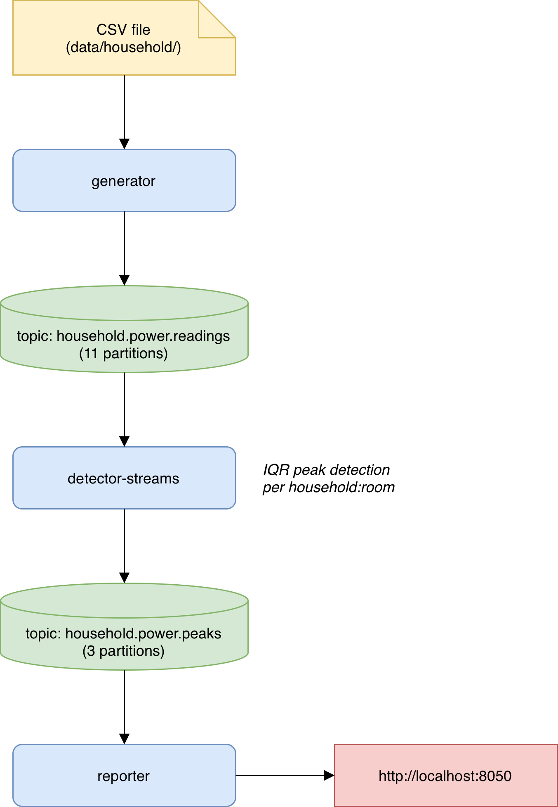
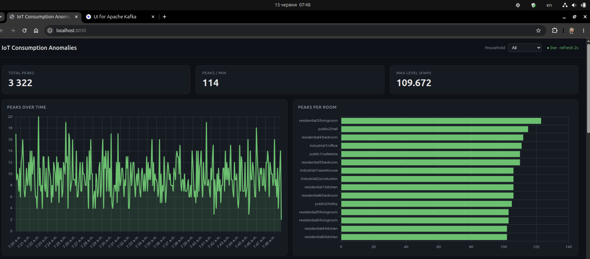
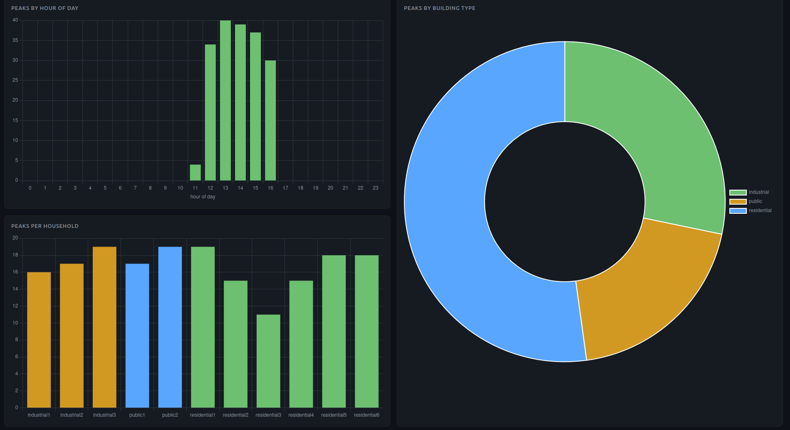
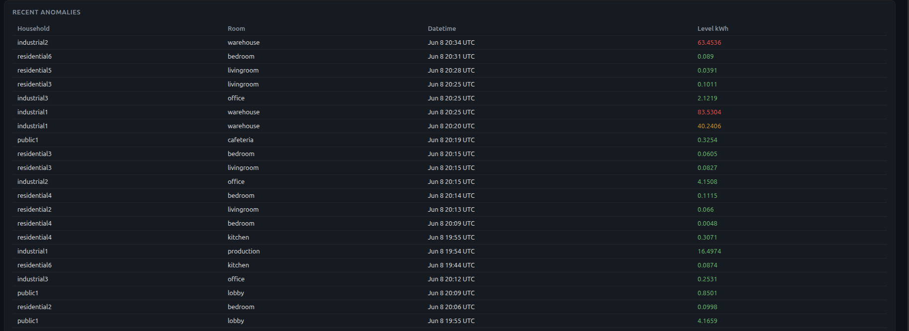

# E2E IoT Streaming Platform

End-to-end data processing pipeline for household energy consumption streams using Apache Kafka, with IQR-based peak detection and a live web dashboard.

**Data:** synthetic 1-minute energy readings (kWh) for 11 buildings (residential, industrial, public) generated by `data/generate_synthetic.py`, with configurable anomaly injection.

---

## Architecture



---

Supporting services running alongside: **broker** (Confluent Kafka 7.6, KRaft mode — no ZooKeeper), **kafka-ui** (`http://localhost:8080`).

Messages are serialized as plain JSON — no Schema Registry is used.

The **generator** reads the CSV and emits one Kafka message per meter reading (all feed types: `grid_import`, `pv`, appliances, etc.).

The **detector-streams** is a Java Kafka Streams application. It consumes readings, maintains a rolling IQR window **per `household:room` pair** in a persistent RocksDB-backed state store, and publishes a peak event whenever `grid_import` exceeds the upper Tukey fence (`Q3 + sigma × IQR`).

The **reporter** consumes peak events and serves a live dashboard with charts and an anomaly table, refreshed every 2 seconds.

---

## Prerequisites

- Docker + Docker Compose

---

## Setup

### 1. Generate synthetic data

```bash
python data/generate_synthetic.py          # 10 000 rows, 2 % anomaly rate (default)
python data/generate_synthetic.py --rows 100000 --anomaly-rate 0.05  # larger set
```

This writes `data/household/synthetic_data.csv`, which is mounted into the generator container.

### 2. Start everything

```bash
docker compose up --build -d
```

This starts the broker, Kafka UI, creates both topics, then launches the generator, detector, and reporter. Wait ~30 s for the broker healthcheck to pass before services begin producing/consuming.

- Kafka UI: **http://localhost:8080**
- Dashboard: **http://localhost:8050**

### 3. Verify messages are flowing

```bash
# Readings topic
docker compose exec broker kafka-console-consumer \
  --bootstrap-server localhost:9092 \
  --topic household.power.readings \
  --max-messages 5

# Peaks topic
docker compose exec broker kafka-console-consumer \
  --bootstrap-server localhost:9092 \
  --topic household.power.peaks \
  --from-beginning
```

---

## Message Formats

**`household.power.readings`** — key: `household:room`
```json
{
  "household": "residential1",
  "room": "kitchen",
  "feed": "grid_import",
  "utc_timestamp": "2026-01-01T00:01:00+00:00",
  "value_kwh": 0.0312
}
```

**`household.power.peaks`** — key: `household:room`
```json
{
  "household": "residential1",
  "room": "kitchen",
  "datetime": "2026-01-01T00:01:00+00:00",
  "level": 0.3678
}
```

`level` is `value_kwh − upper_fence` at the moment of detection — how far above the threshold the reading was.

---

## Configuration

### Generator

| Variable | Default | Description |
|---|---|---|
| `BOOTSTRAP_SERVERS` | `broker:9092` | Kafka broker address |
| `TOPIC` | `household.power.readings` | Target topic |
| `DATA_SOURCE` | `/data/household/synthetic_data.csv` | Path to the CSV inside the container |
| `EVENTS_PER_SECOND` | `100` | Playback rate (messages/sec) |
| `LOOP` | `true` | Replay the CSV continuously |

### Detector-Streams

| Variable | Default | Description |
|---|---|---|
| `BOOTSTRAP_SERVERS` | `broker:9092` | Kafka broker address |
| `INPUT_TOPIC` | `household.power.readings` | Topic to consume |
| `OUTPUT_TOPIC` | `household.power.peaks` | Topic to publish peaks to |
| `APPLICATION_ID` | `peak-detector-streams` | Kafka Streams application ID |
| `WINDOW_SIZE` | `200` | Rolling window size per household:room (samples) |
| `MIN_WINDOW` | `30` | Minimum samples before detection activates |
| `SIGMA` | `1.5` | IQR multiplier for the upper Tukey fence |
| `DETECTION_FEED` | `grid_import` | Feed type to run detection on |

### Reporter

| Variable | Default | Description |
|---|---|---|
| `BOOTSTRAP_SERVERS` | `broker:9092` | Kafka broker address |
| `INPUT_TOPIC` | `household.power.peaks` | Topic to consume |
| `GROUP_ID` | `anomaly-reporter` | Kafka consumer group |
| `FROM_BEGINNING` | `true` | Replay all peaks from the start on restart |
| `MAX_EVENTS` | `5000` | In-memory event buffer size |
| `PORT` | `8050` | HTTP port for the dashboard |

---

## Tuning Peak Sensitivity (SIGMA)

`SIGMA` is the IQR multiplier that controls how aggressively peaks are flagged. The default `1.5` is the classic Tukey value.

**One-off run with a different sigma:**
```bash
docker compose run -e SIGMA=0.5 detector-streams
```

**Persistent change via `docker-compose.yml`:** edit the `SIGMA` value under the `detector-streams` service and restart:
```bash
docker compose up -d --no-deps detector-streams
```

---

## Peak Detection Algorithm

For each `grid_import` reading per `household:room` pair, the detector maintains a sliding window of the last `WINDOW_SIZE` values. Once the window reaches `MIN_WINDOW` samples, it computes:

```
Q1, Q3  = 25th and 75th percentile of the window
IQR     = Q3 − Q1
fence   = Q3 + SIGMA × IQR
```

If the current reading exceeds `fence`, a `PeakEvent` is emitted. The current value is evaluated against the existing window before being added to it, preventing an outlier from inflating its own threshold.

The `level` field in the peak event records how far above the fence the reading was (`value_kwh − fence`), allowing post-analysis of peak severity.

---

## Dashboard

The reporter serves a live dashboard at **http://localhost:8050**, auto-refreshed every 2 seconds.

**Panels:**
- Summary cards — total peaks, peaks/min, max level (kWh above fence)
- Peaks over time (line chart, 5-second buckets)
- Peaks per room (top 15, horizontal bar)
- Peaks by hour of day (distribution bar)
- Peaks per household (color-coded by building type)
- Peaks by building type (doughnut: residential / industrial / public)
- Recent anomalies table — household, room, timestamp, level (color-coded by severity)



